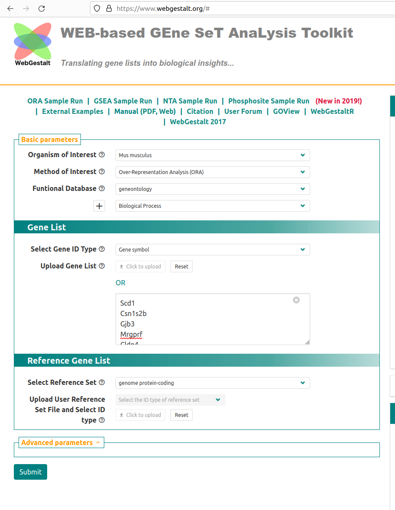
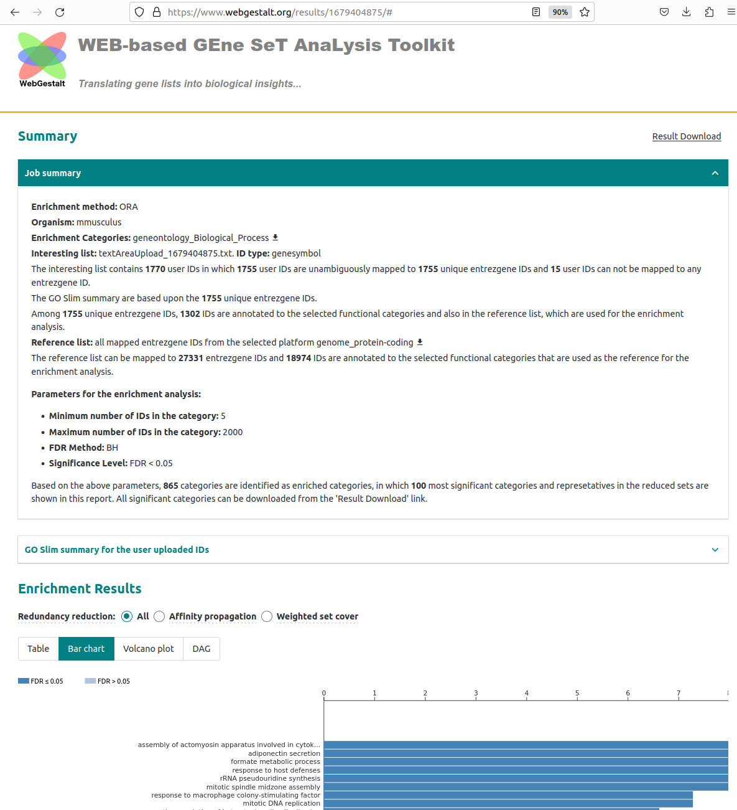
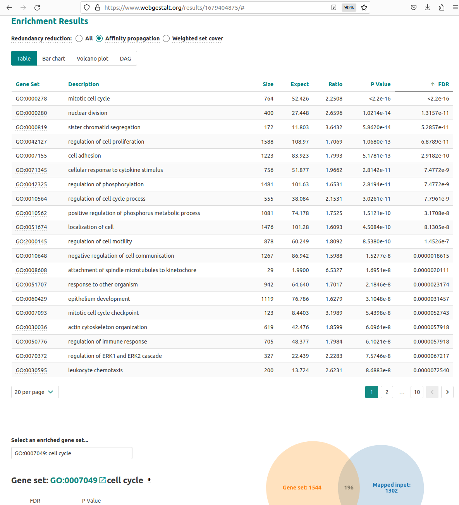
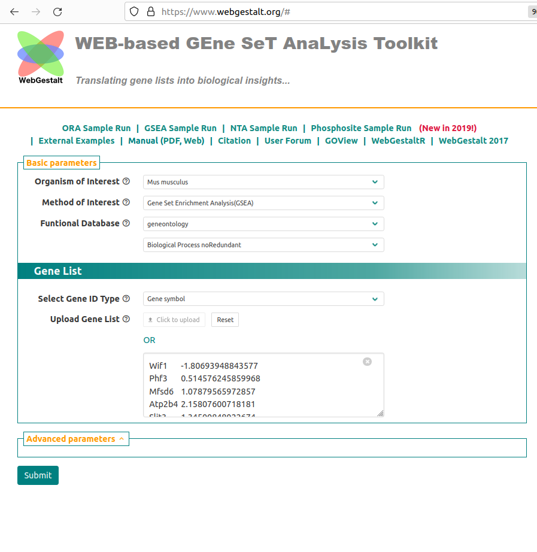
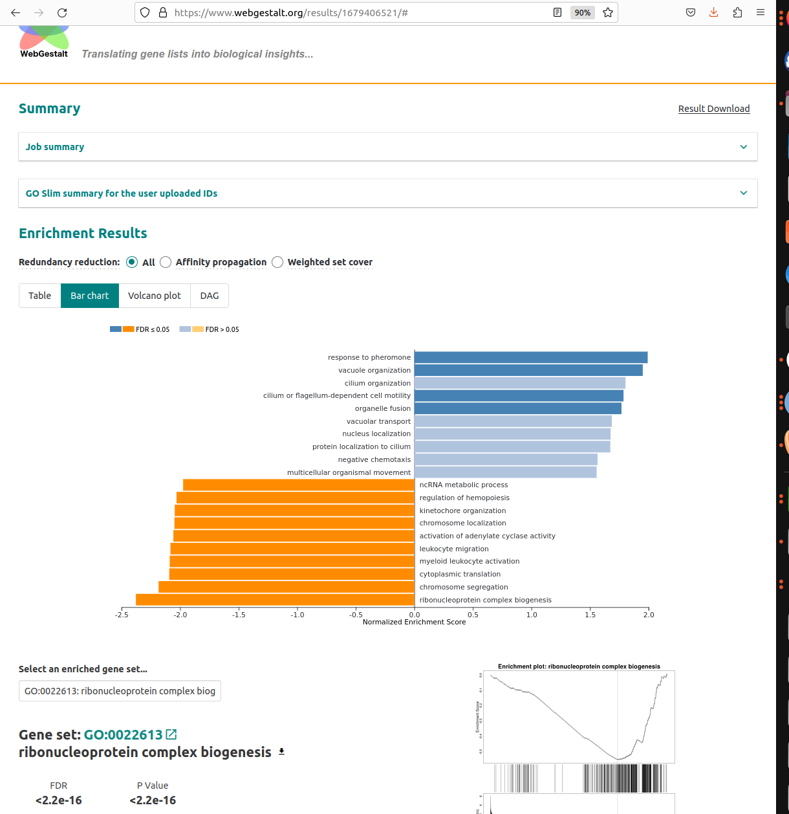

### Sheffield Bioinformatics Core


web : [sbc.shef.ac.uk](https://sbc.shef.ac.uk)\
twitter: [\@SheffBioinfCore](https://twitter.com/SheffBioinfCore)\
email: [bioinformatics-core\@sheffield.ac.uk](bioinformatics-core@sheffield.ac.uk)

------------------------------------------------------------------------

# Workshop Overview


## Objectives:- After this course you should be able to:

- Appreciate some of the issues that can arise when designing an RNA-seq experiment 
- Interpret an Multi-dimensional scaling (MDS) plot to check for batch effects and confounding factors
- Use Degust to generate a statistically robust gene list
- Perform a gene set enrichment analysis using available online tools

## Aims:- During this course you will learn about:

- Basic principles of Experimental design for RNA-seq experiments
- The steps in a best-practice pipeline for RNA-seq analysis
- Configuring the Degust interface to perform different types of differential expression
- The theory behind popular methods for pathways and gene set enrichment analysis

An overall workflow for the processing and analysis of RNA-seq data is given in the image below from [Ting-You Wang's RNA-seq analysis page](https://databeauty.com/blog/tutorial/2016/09/13/RNA-seq-analysis.html).


In this workshop we are going to concentrate on differential-expression and pathways analysis - which are the **least computationally-intensive** parts of the workflow and require the **least Bioinformatics experience**.

For those interested in alignment and QC steps, we have some materials available that use the Galaxy online resource

-   [Pre-processing materials](https://sbc.shef.ac.uk/ngs_intro_workshop/03-rna-seq.nb.html)

**We will also have some courses on using the command-line and the nextflow workflow manager to process raw RNA-seq data.**

However, regardless of whatever method you use to process the data, decisions that you make before commencing sequencing can have a huge impact on the results.

## Background videos

A short introduction to Next Generation Sequencing can be found in this youtube video

- [Next Generation Sequencing (Illumina) An Introduction - Henrik’s Lab](https://www.youtube.com/watch?v=CZeN-IgjYCo)

A good overview of RNA-seq analysis can be found here

- [StatQuest: A gentle introduction to RNA-seq](https://www.youtube.com/watch?v=tlf6wYJrwKY)


## RNA-seq pre-processing **In brief**

We will now *briefly* describe the processes involving in turning raw sequencing data into the data that we will be using in this workshop.

### Raw RNA-seq data

Raw raw-seq data are delivered in the form of *fastq* files. These are large (typically several Gb) that contain information on the sequences that have been generated for each biological sample; one fastq (or pair of fastqs) for each sample. Each set of four lines describe one sequence (called a "read").

A typical RNA-seq experiment will have 10 - 30 million reads in a fastq file, with each read about 100 bases long

```
@D0UW5ACXX120511:8:1204:6261:40047/1
AATGTTTATGTTCTTAAATTTTAGTTGTATATGTGAATCTTTGTAGTTTTTGCTAAAATACTAAGTAATTTATATAAAAGTGAGTTAAGAGATTTTTCTGA
+
CCCFFFFFHHHHHJJJJJIJJJJJIJJHIIJIJIJJIJJJIJJHIIHIJJJJJJBEGIHIJICGIDICFGIJJJIIJJGJ>F>GAGCGEEHEHHEEFFFD>
```


Quality assessment can be performed to see if the raw sequences are of sufficient quality for analysis


As the fastq files are large, we tend to analyse them using command-line software and a computing cluster

### RNA-seq alignment

The *traditional workflow for RNA-seq* compares the sequences to a reference genome to see which genomic region each read matches the best.


Again, this requires more memory than a typical laptop or desktop machine so is performed on a remote computer with large memory. The resulting file is called a *bam* and records the best genomic match for each read. However, as we are interested in gene expression we want to relate these mappings to the positions of genes.

### Assigning reads to features

A variety of different counting methods can determine how many reads overlap each known gene region. These are know as the raw counts and are the kind of data we will start with today.


Recent tools for RNA-seq analysis (e.g. `salmon`, `kallisto`) do not require the time-consuming step of whole-genome alignment to be performed, and can therefore produce gene-level counts in a much faster time frame. They not require the creation of large bam files, which is useful if constrained by file space on Galaxy.


(image from Harvard Bioinformatics Core)


## Experimental Design

Before embarking on any high-throughput experiment, it is important to pay due attention to the *experimental design*. This famous quote from the statistician R.A Fisher in the 1938 is still applicable to modern technologies

> **To call in the statistician after the experiment is done may be no more than asking him to perform a postmortem examination: he may be able to say what the experiment died of.**

Experimental Design encompasses questions such as

-   which controls to use?
    -   positive / negative controls
    -   healthy controls
-   what experimental conditions?
-   what technical and biological factors are present?

When performing a high-throughput experiment, our measurements will be subject to biological variation (which we may be interested in) and technical variation (which we probably won't be). Being able to control these factors and minimise biases is key to experimental design.

Confounding factors in our design may arise by accident, or might be caused by not considering all possible sources of variation:-

 (image from Cancer Research UK Cambridge Institute course on Experimental Design)

We can also introduce so-called "batch-effects" by our choice of when samples are prepared for sequencing. Large experiments may necessitate multiple runs or batches, and we should try and minimize the possible impact of batches but including a good representation of each condition of interest in each batch.

 (image from Cancer Research UK Cambridge Institute course on Experimental Design)

When planning next-generation sequencing experiments, you will also need to consider

-   the type of sequencing (e.g. whole-genome, exome, RNA-seq)
    -   will largely be dictated by your biological question
-   single-end or paired-end
-   how many reads (10 Million? 20 Million?, 100 Million?)

Some recommendations on these questions and more are provided by the [Cancer Research Uk Cambridge Institute Genomics Core](https://www.cruk.cam.ac.uk/core-facilities/genomics-core/sequencing). Often the sequencing vendor performing your experiment will have some default options available.

The vendor may not advise on the *sample-size*; how many samples you will be sequencing to address your biological hypothesis of interest. This is a complex question and is often influenced by practical and financial constraints. For researchers based in Sheffield, The Sheffield Bioinformatics Core is able to advise on this, and any of the other issues above. `bioinformatics-core@sheffield.ac.uk`

# Differential expression

## Input Data

A differential expression analysis requires two input files to be created.

-   a count matrix
-   a sample sheet or meta data table

The count matrix can be obtained by performing quantification (outside the scope of this workshop...). This will usually be generated for you by the sequencing vendor or Bioinformatics Core. The structure of the count matrix is shown below.

| **gene** | **sampleA** | **sampleB** |
|:--------:|:-----------:|:-----------:|
|    A     |    1500     |     900     |
|    B     |     20      |     10      |
| **...**  |   **...**   |   **...**   |

The gene named A was sequenced 1500 times on sampleA and 900 times on sampleB etc. These are referred to as *raw counts*. However, we cannot just put this numbers into a standard statistical test (e.g. t-test) to assess significance. There are several reasons for this.

-   The count values do not follow a normal-distribution so cannot be analysed using traditional methods
-   There are many, many genes being measured in the dataset leading to a multiple testing problem.
-   The count values are influenced by technical (as opposed to biological) variation that need to be accounted for:-
    -   size of gene; *longer* genes will have more reads assigned to them
    -   library size; for a sample that is sequenced to a higher depth it will seem as though all genes are more highly-expressed.

The sample sheet or meta data is used to associate each column in the count matrix to 

| **Name** | **Condition** | **Gender** | **Batch** |
|:--------:|:-----------:|:-----------:|:-----------:|
|    sampleA     |    Healthy     |     M     | 1
|    sampleB     |     Disease      |     F      | 1
| sampleC  |   Disease   |   M   | 2

The term *differential expression* was first used to refer to the process of finding statistically significant genes from a *microarray* gene expression study.

In this figure we show the expression level measured for a gene in a number of different samples. Each sample belongs to biological condition A or B. We are interested in whether the expression level of the gene is different in condition A or B (which could represent healthy or disease individuals, for example).


Such methods were developed on the premise that microarray expression values are approximately *normally-distributed* when appropriately transformed (e.g. by using a log$_2$ transformation) so that a modified version of the standard *t-test* can be used. The same test is applied to each gene under investigation yielding a *test statistic*, *fold-change* and *p-value*. Similar methods have been adapted to RNA-seq data to account for the fact that the data are *count-based* and do not follow a normal distribution.

## Interactive exploration of the results with *DEGUST*


<font size="8"><http://degust.erc.monash.edu/></font>

`Degust` is a web tool that can analyse counts files and test for differential gene expression. It offers and interactive view of the differential expression results and also sample quality assessment.

R-based methods such as `edgeR` (implemented in Degust) and `DESeq2` have their own method of normalising counts. You will probably encounter other methods of normalising RNA-seq reads such as *RPKM*, *CPM*, *TPM* etc. [This blog](https://www.rna-seqblog.com/rpkm-fpkm-and-tpm-clearly-explained/) provides a nice explanation of the current thinking. As part of the `Degust` output, you have the option of downloading normalised counts in various formats. Some other online visualisation tools require normalised counts as input, so it is good to have these to-hand.

We will use a previously-published count matrix. This was downloaded from the Gene Expression Omnibus (GEO) under the accession number [GSE60450](https://www.ncbi.nlm.nih.gov/geo/query/acc.cgi?acc=GSE60450). Note that we have shortened the column headings and added gene symbols to help with visualisation and annotation


::: exercise
Download the counts from [this link](GSE60450_Lactation_forAnalysis.csv)
:::

### Uploading the count matrix to Degust

-   From the main degust page, click *Upload your counts file*
-   Click on Browse
-   Select the location of the file `GSE60450_Lactation-GenewiseCounts_rename_symbol.csv`, and click *Open*.
-   Click *Upload*
-   A Configuration page will appear.


-   For Name type "*GSE60450*" (or whatever you want to call the analysis)
-   For Info columns select *SYMBOL*
-   Click Add condition
    -   Referring to the experiment design (below), select the Basal samples and call the condition Basal
    -   Repeat for the Luminal samples
-   Save the settings and then View the results

| Run        | Name    | CellType | Status    |
|------------|---------|----------|-----------|
| SRR1552444 | MCL1-LA | basal    | virgin    |
| SRR1552445 | MCL1-LB | luminal  | virgin    |
| SRR1552446 | MCL1-LC | Luminal  | pregnancy |
| SRR1552447 | MCL1-LD | Luminal  | pregnancy |
| SRR1552448 | MCL1-LE | luminal  | lactation |
| SRR1552449 | MCL1-LF | luminal  | lactation |
| SRR1552450 | MCL1-DG | basal    | virgin    |
| SRR1552451 | MCL1-DH | luminal  | virgin    |
| SRR1552452 | MCL1-DI | basal    | pregnancy |
| SRR1552453 | MCL1-DJ | basal    | pregnancy |
| SRR1552454 | MCL1-DK | basal    | lactation |
| SRR1552455 | MCL1-DL | basal    | lactation |

### Overview of Degust sections

-   Top black panel with Configure settings at right.
-   Left: Conditions: Control and Treatment.
-   Left: Method selection for DGE. 
-   Top centre: Plots, with options at right.
-   When either of the expression plots are selected, a heatmap appears below.
-   A table of genes (or features); expression in treatment relative to control (Treatment column); and significance (FDR column).

(**Not that the screenshots are for illustration purposes and taken from a different dataset to that being analysed in the tutorial**)


## MA-plot


Each dot shows the change in expression in one gene.

-   The average expression (over both condition and treatment samples) is represented on the x-axis.
    -   Plot points should be symmetrical around the x-axis.
    -   We can see that many genes are expressed at a low level, and some are highly expressed.
-   The fold change is represented on the y axis.
    -   If expression is significantly different between batch and chem, the dots are red. If not, they are blue. (In Degust, significant means FDR \<0.05).
    -   At low levels of gene expression (low values of the x axis), fold changes are less likely to be significant.

Click on the dot to see the gene name.

## Parallel coordinates and heatmap


Each line shows the change in expression in one gene, between control and treatment.

-   Go to Options at the right.
    -   For FDR cut-off set at 0.001.
    -   This is a significance level (an adjusted p value). We will set it quite low in this example, to ensure we only examine key differences.
-   Look at the Parallel Coordinates plot. There are two axes:
    -   Left: Control: Gene expression in the control samples. All values are set at zero.
    -   Right: Treatment Gene expression in the treatment samples, relative to expression in the control.
-   The blocks of blue and red underneath the plot are called a heatmap.
    -   Each block is a gene. Click on a block to see its line in the plot above.
    -   Look at the row for the chem. Relative to batch, genes expressed more are red; genes expressed less are blue.

## Table of genes


Table of genes

-   gene_id: names of genes. Note that gene names are sometimes specific to a species, or they may be only named as a locus ID (a chromosomal location specified in the genome annotation).
-   FDR: False Discovery Rate. This is an adjusted p value to show the significance of the difference in gene expression between two conditions. Click on column headings to sort. By default, this table is sorted by FDR.
- log2(Fold Change) of gene expression. This shows the fold-change (on a log$_2$ scale) of each gene relative to the group of samples chosen as the baseline. A positive value (coloured in red) indicates the gene is higher compared to the baseline, and negative indicates that it is lower. The direction of the comparison can be changed in the Options panel, but this just changes the sign (positive or negative) and not corresponding the p-value.
  + the direction of fold-change should be determined based on your biological question. For example, if you were sequencing treatment and control groups it would make sense to make the fold-changes relative to the control. Similarly for disease and healthy groups it would make sense to look at changes relative to the healthy group.

The table can be sorted according to any of the columns (e.g. fold-change or p-value)

## Download and R code

Above the genes table is the option to download the results of the current analysis to a csv file. You can also download the *R* code required to reproduce the analysis by clicking the *Show R code* box underneath the Options box.

Plots such as the MDS, MA and heatmap can also be exported by right-clicking on the plot.

## MDS plot

This is a multidimensional scaling plot which represents the variation between samples. It is a similar concept to a Principal Components Analysis (PCA) plot. The x-axis is the dimension with the highest magnitude. In a standard control/treatment setup, samples should be split along this axis. A desirable plot is shown below:-


## Exercise

::: exercise
**Question:** Do the sample groupings in the MDS plot make sense? Do any samples appear to be mislabeled? What effect might this have on the analysis?
:::

::: exercise
**Question:** Having identified the problem with the analysis, modify the configuration and repeat. How many genes are differentially expressed this time?
:::

## Analysing a different contrast

Comparing Basal vs Luminal wasn't really the main question of interest in the dataset, but it serves to illustrate the importance of checking QC plots.

-   Create conditions *Basal.Pregnant*, *Basal.Lactation*, etc using the **corrected experimental design**
-   Make sure that *Basal.Pregnant* and *Basal.Lactation* are both ticked as initial select


::: exercise
**Exercise:** Make sure the FDR cut-off and abs LogFC cutoffs are set to default and *download* the file and rename to `background.csv`. We will use this later.
:::

::: exercise
**Exercise**: How many genes are differentially-expressed with an FDR \< 0.05 and abs logFC \> 1. Download this file and rename it to `B.preg_vs_lactation.csv`.
:::

::: exercise
**Exercise**: Repeat the analysis for Luminal.Pregnant vs Luminal.Lactation and download the table of differentially-expressed results (same FDR and log fold-change).
:::

### File Downloads

::: information
If you didn't manage to complete these analyses, you can download the files from here by right-clicking on each link and selecting "Save Link as" (or equivalent). They are also available in the course google drive.

-   [B.preg_vs_lactation.csv](B.preg_vs_lactation.csv)
-   [L.preg_vs_lactation.csv](L.preg_vs_lactation.csv)
-   [background.csv](background.csv)
:::

## Overlapping Gene Lists

We might sometimes want to compare the lists of genes that we identify using different methods, or genes identified from more than one contrast. In our example dataset we can compare the genes in the contrast of pregnant vs luminal in basal and luminal cells

The website *venny* provides a really nice interface for doing this.


-   Open both your *Basal Pregnant vs Basal Lactation* and *Luminal Pregnant vs Luminal Lactation* results files in Excel
-   Go to the venny website
    -   <http://bioinfogp.cnb.csic.es/tools/venny/>
-   Copy the names of genes with adjusted p-value less than 0.05 in the Basal analysis into the **List 1** box on the venny website. **List 1** can be renamed to *Basal*
    -   *You can select all entries in a column with the shortcut CTRL + SPACE*
-   Copy the names of genes with adjusted p-value less than 0.05 in the Luminal analysis into the **List 2** box on the venny website. **List 2** can be renamed to **Luminal**
-   venny should now report the number of genes found in each list, the size of the intersection, and genes unique to each method

## Modified analysis using Hidden Factors

Let's consider the situation where we want to identify genes that are different between pregnancy and lactating samples *regardless of the cell type*. We have already done this using the venn diagram approach above, but in this final analysis we will include all the pregnancy and lactating samples, but correct for the differences in cell type. This is more efficient than analysing each cell type separately and comparing the results. Each statistical test we do will involve calling many false positives. We can achieve the same outcome by performing just one statistical test.

This can be done by telling Degust about the *hidden factors* in our dataset. The hidden factor in this dataset is whether the sample is from the `basal` or `luminal` samples. In other words, this is a technical factor that influences our results but not a factor that we wish to compare. We only need to specify which samples are from `basal` and DEGUST will infer that the other samples belong to a different cell type.

See below for the correct configuration to include the hidden factors.


You should see that on the MDS plot the samples cluster according to cell type. However, this is fine because we are going to incorporate this hidden factor in the analysis


::: exercise
**Exercise**: How many genes are differentially-expressed with an adjusted p-value cut-off of 0.05 and log2 cutoff of 1. How does this compare the number of intersecting genes in your venn diagram above.
:::

The hidden factor method can be used to analyse datasets where samples cluster on technical rather than biological factors. e.g.

-   sample batch
-   gender

In the below example, the main factor separating the samples is the experimental batch and not group (IR, CTR or TGF)


However, the hidden factor approach can only be used if your **experimental design was robust** and the technical variation is not confounded with biological groups. e.g. treated and untreated samples should be in all batches

# Enrichment and Pathways Analysis

The differential expression step is concerned with being able to say with confidence whether an individual gene has a different level of expression between biological groups. However, in this section we move towards discovering if our results are ***biologically significant***. Are the genes that we have picked statistical flukes, or are there some commonalities?

It can be informative to scan (manually) through the gene lists we generate through Degust and use our Biological intuition to look for themes. We might also look for previously-published genes, or genes that we have intentionally-manipulated (e.g. by knocking-out that gene). However, sometimes we can mislead ourselves into thinking our results are more significant than they really are.

For example, the "cell cycle process" Gene Ontology has many hundreds of genes belonging to it. If we were to pick a set of genes **at random** of equivalent size as our list of differentially-expressed genes **we should not be surprised** to see a lot of cell-cycle genes appearing in the list. This is just due to the fact that we had a lot of possible cell-cycle genes to choose from. The key question is whether the number of cell-cycle (or any other pathway) is *more than we would expect by chance*.

In this section we will use the following files

-   [`background.csv`](background.csv) containing one row for each gene in the comparison Basal.pregnant vs Basal.lactation (27,179 rows).
-   [`B.preg_vs_lactation.csv`](B.preg_vs_lactation.csv) containing one row for each found to be DE in the contrast Basal.pregnant vs Basal.Lactation.

It will be helpful to have both these files open in Excel.


There are two different approaches one might use, and we will cover the theory behind both. The distinction is whether you are happy to use a hard (and arbitrary) threshold to identify DE genes.

## Over-representation analysis (ORA)

"Threshold-based" methods require definition of a statistical threshold to define list of genes to test (e.g. FDR \< 0.01). Then a *hypergeometric* test or *Fisher's Exact* test is generally used. These methods require plenty of DE genes as an input, so people often use more-relaxed criteria for identifying DE genes (e.g. raw rather than adjusted p-values or FDR value but in conjuction with a fold-change cut-off)

The question we are asking here is;

> ***"Are the number of DE genes associated with Theme X significantly greater than what we might expect by chance alone?"***

We can answer this question by knowing

-   the total number of DE genes
-   the number of genes in the gene set (pathway or process)
-   the number of genes in the gene set that are found to be DE
-   the total number of tested genes (background)

You will never need to know this, but for those interested  the formula for Fishers exact test is;

$$ p = \frac{\binom{a + b}{a}\binom{c +d}{c}}{\binom{n}{a +c}} = \frac{(a+b)!(c+d)!(a+c)!(b+d)!}{a!b!c!d!n!} $$

with:-

| **Differentially Expressed** | **Not Differentially Expressed** | **Total** |                        |
|:----------------:|:----------------:|:----------------:|:----------------:|
|         In Gene Set          |                a                 |     b     |         a + b          |
|       Not in Gene Set        |                c                 |     d     |         c + d          |
|          **Total**           |            **a + c**             | **b +d**  | **a + b + c + d (=n)** |

In this first test, our genes will be grouped together according to their Gene Ontology (GO) terms:- <http://www.geneontology.org/>

## Using WebGestalt for ORA

<div class="information">
**N.B.** Previous version of this course used the website GOrilla for this section. However, at the time of writing this site no longer seems to be working. We have switched to using WebGestalt which can perform the same statistical tests as GOrilla and has a nicer interface.
</div>

There are several popular online tools for performing enrichment analysis

We will be using the online tool [WebGestalt](https://www.webgestalt.org/) to perform the pathways analysis. It supports has various types of analysis; the first of which accepts a list pre-selected genes.

1.  Go to <https://www.webgestalt.org/#>
2.  Choose the **ORA Sample Run** Tab



3.  Choose Organism: `Mus Musculus`
4.  Make sure that **Method of interest** is set to Over-Representation Analysis (ORA)
5.  Select **Functional Database** *geneontology*
  + you can change this later if you wish
6.  Keep **Select Gene ID Type* as *Gene symbol*
7.  Paste the gene symbols corresponding to DE genes in *Basal pregant vs Basal Lactation* into the Upload Gene List box.

-   **The shortcut CTRL + SPACE will let you select an entire column**

8. In **Select Reference Set** make sure *genome protein-coding* is selected.
9. Click Submit


The page that appears can give a summary of the analysis performed (i.e. the number of genes that were used as input and how many names were recognised as valid gene names) along with various visualisations. The *bar plot* shows the amount of enrichment for the pathways identified as being significant. A larger enrichment score indicates for a pathway indicates that genes are found in the list of gene names **more than you would expect by chance**. However, the pathways with the largest enrichment are not neccesarily the most significant.



The table output shows details of the most over-represented pathways. Clicking on a pathway name in the left-hand column gives more information on the genes belonging to that pathway - including the names of genes in that pathway that were found in the list of genes. The **Expect** and **Ratio** columns indicate how many genes in a pathway that are *expected* to be found in the uploaded gene list, and how many more times genes in the pathway *actually occur* in the gene list. All columns in the table can be sorted.




::: exercise
**Exercise:** Use WebGestalt to find enriched pathways in the Basal pregnant vs lactation analysis
:::


## Threshold-free analysis

This type of analysis is popular for datasets where differential expression analysis does not reveal many genes that are differentially-expressed on their own. Instead, it seeks to identify genes that as a group have a tendency to be near the extremes of the log-fold changes. The results are typically presented in the following way.


The "barcode"-like panel represents where genes from a particular pathway (**HALLMARK_E2F_TARGETS** in this case) are located in a gene list *ranked* from most up-regulated to most down-regulated. The peak in the green curve is used to indicate where the majority of genes are located. If this is shifted to the left or the right it indicates that genes belonging to this gene set have a tendancy to be up- or down-regulated.

As such, it does not rely on having to impose arbitrary cut-offs on the data. Instead, we need to provide a measure of the importance of each gene such as it's fold-change. These are then used the rank the genes.

The Broad institute has made this analysis method popular and provides [a version of GSEA](http://software.broadinstitute.org/gsea/index.jsp) that can be run via a java application. However, the application can be a bit fiddly to run, so we will use the Webgestalt website again

<https://www.webgestalt.org/#>

-   Open the file `background.csv` in Excel and delete all columns except the `SYMBOL` and `basal.lactation` column. 
-   Go to the Webgestalt website, and select **GSEA Sample Run** from the front page
-   Make sure **Method of interest** is set to *Gene Set Enrichment Analysis (GSEA)*
-  Select **Functional Database** as *geneontology*
-   Paste the contents of your modified excel file into the text box under **Upload Gene List**. 
<div class ="information">
Do not paste the header line of **SYMBOL** and **basal.lactation** into the box
</div>
-   Click **Submit**




The Rank of the gene shown is the position of the gene in the ranked list; with 1 being most up-regulated gene. The score is the score used to rank the genes (fold-change in our example). You will have to refer back to your Degust analysis to recall which biological group the fold-change is relative to.

::: exercise
**Exercise:** Use Webgestalt to identify enriched pathways in the Basal Pregnant vs Lactation contrast. Compare the results from the most depleted and enriched pathways and make sure that you can interpret the barcode plot.
:::
